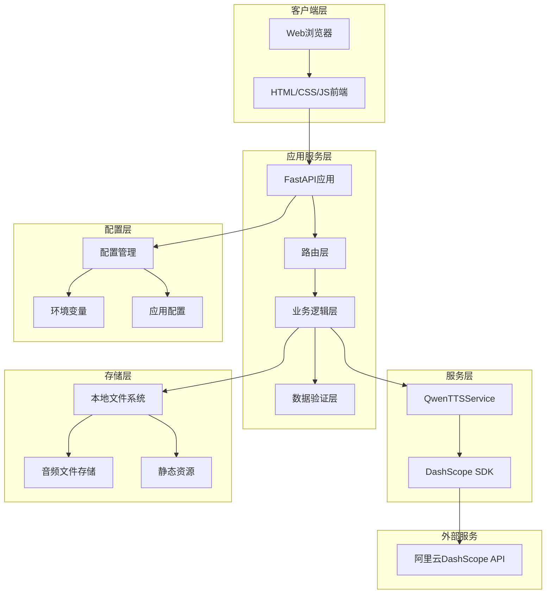
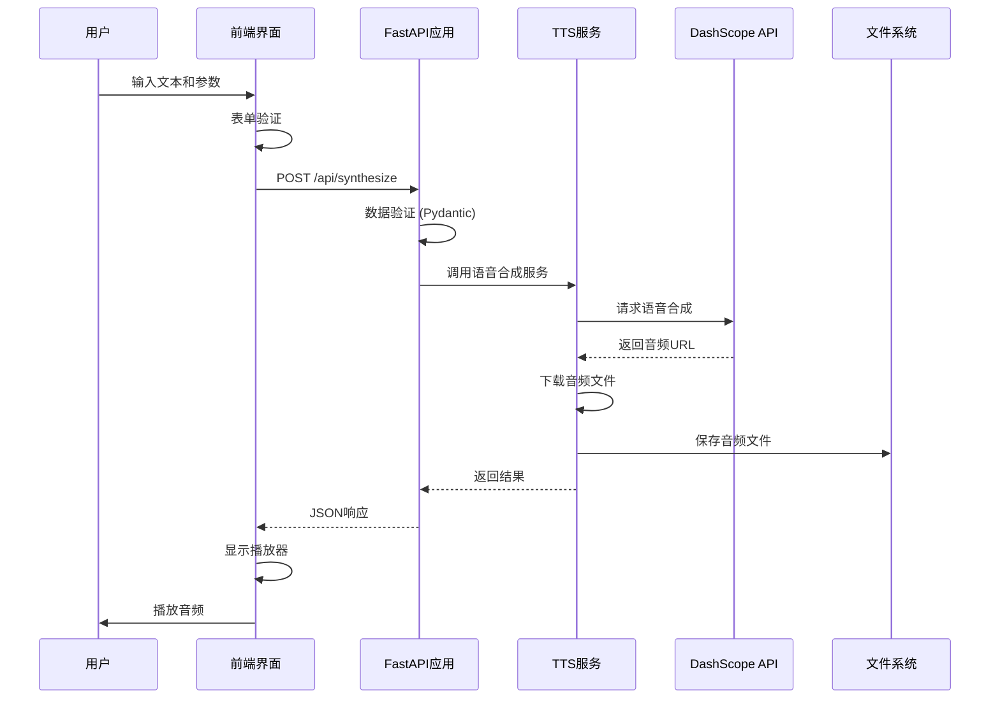
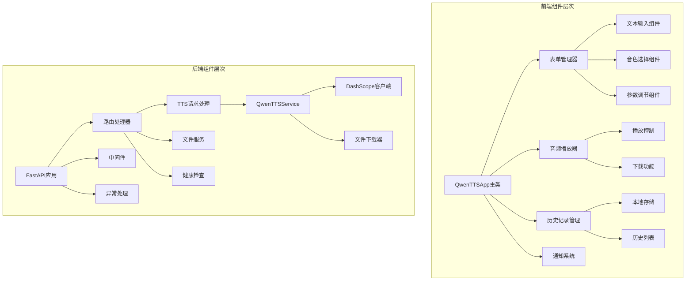
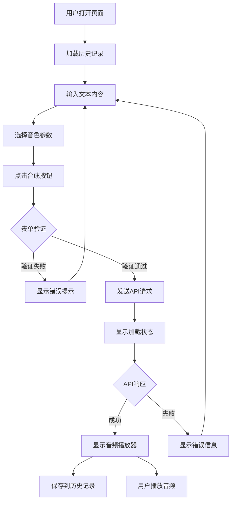
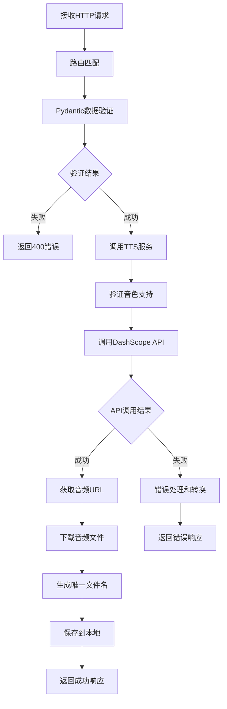
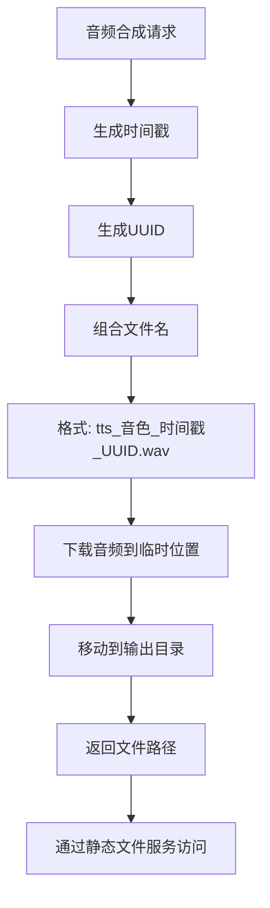
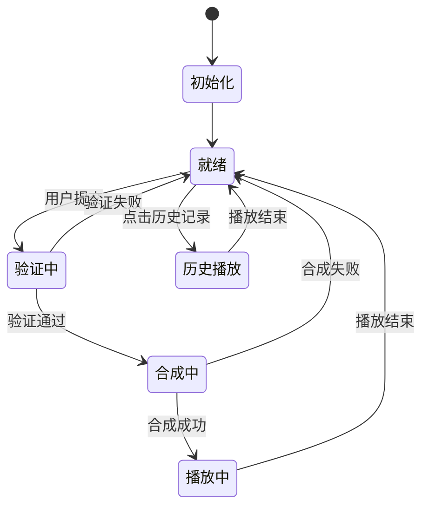
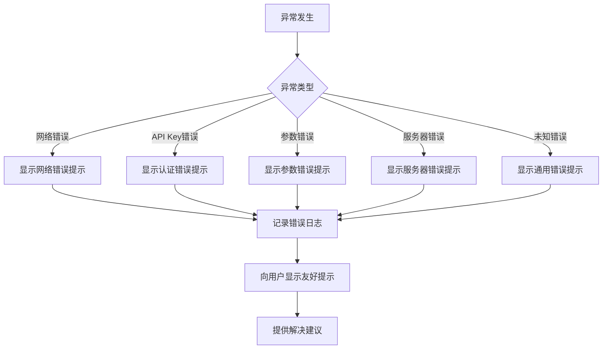

# Qwen-TTS 语音合成服务技术文档

## 📚 目录索引

- [项目概述](#项目概述)
- [技术栈说明](#技术栈说明)
- [系统架构设计](#系统架构设计)
- [项目目录结构](#项目目录结构)
- [安装和运行指南](#安装和运行指南)
- [API接口文档](#api接口文档)
- [核心功能模块详解](#核心功能模块详解)
- [数据流程说明](#数据流程说明)
- [配置文件说明](#配置文件说明)
- [开发指南和最佳实践](#开发指南和最佳实践)
- [常见问题和故障排除](#常见问题和故障排除)

---

## 🎯 项目概述

### 项目简介

Qwen-TTS 语音合成服务是一个基于阿里云 DashScope API 的现代化语音合成 Web 应用。该项目使用 FastAPI 框架构建后端服务，提供了功能丰富的语音合成能力，支持中英双语及多种中文方言。

### 核心功能特性

#### 🎤 语音合成功能
- **多音色支持**：提供7种不同音色，包括中英双语和方言音色
- **方言支持**：北京话（Dylan）、上海话（Jada）、四川话（Sunny）
- **参数调节**：支持语速、音调、音量的精细调节
- **实时合成**：快速响应的异步语音合成处理
- **高质量输出**：默认输出 WAV 格式，保证音质清晰

#### 🎨 用户界面特性
- **现代化设计**：响应式设计，支持多种设备
- **直观操作**：简洁易用的用户交互界面
- **历史记录**：自动保存合成历史，支持重播和下载
- **实时反馈**：字符计数、状态提示和进度显示

#### 🔧 技术特性
- **异步处理**：基于 FastAPI 的高性能异步 API
- **错误处理**：完善的错误处理和用户反馈机制
- **文件管理**：自动音频文件管理和清理
- **API 文档**：完整的 OpenAPI 文档支持

---

## 💻 技术栈说明

### 后端技术栈

#### 核心框架
- **FastAPI** (Web框架)
  - 现代、快速的 Python Web 框架
  - 自动生成 OpenAPI 文档
  - 内置数据验证和序列化
  - 异步支持，高性能处理

#### 语音合成服务
- **DashScope SDK** (阿里云语音合成)
  - 官方 Python SDK
  - 支持多种音色和语言
  - 稳定的云服务支持

#### 数据处理和验证
- **Pydantic** (数据验证)
  - 类型安全的数据验证
  - 自动文档生成
  - JSON Schema 支持

#### 异步和文件处理
- **aiofiles** (异步文件操作)
- **requests** (HTTP 客户端)
- **python-multipart** (文件上传支持)

#### 配置和环境管理
- **python-dotenv** (环境变量管理)
- **uvicorn** (ASGI 服务器)

### 前端技术栈

#### 核心技术
- **HTML5** (结构层)
  - 语义化标签
  - 音频播放支持
  - 表单验证

- **CSS3** (样式层)
  - CSS Grid 和 Flexbox 布局
  - CSS 变量系统
  - 响应式设计
  - 动画和过渡效果

- **Vanilla JavaScript** (交互层)
  - ES6+ 语法
  - 异步 API 调用
  - 事件驱动架构
  - 本地存储管理

#### UI/UX 设计
- **Font Awesome** (图标库)
- **Google Fonts** (字体服务)
- **响应式设计** (多设备适配)

---

## 🏗️ 系统架构设计

### 整体架构图



### 数据流程图



### 组件关系图



---

## 📁 项目目录结构

```
qwen-tts-service/
├── 📄 main.py                 # FastAPI主应用文件
├── 📄 config.py               # 配置文件和常量定义
├── 📄 start.py                # 服务启动脚本
├── 📄 install.py              # 自动安装脚本
├── 📄 demo.py                 # 功能演示脚本
├── 📄 requirements.txt        # Python依赖包列表
├── 📄 .env.example           # 环境变量模板
├── 📄 .gitignore             # Git忽略文件配置
├── 📄 README.md              # 项目说明文档
├── 📁 templates/             # Jinja2模板目录
│   └── 📄 index.html         # 主页面模板
├── 📁 static/                # 静态资源目录
│   ├── 📄 style.css          # 样式文件
│   └── 📄 script.js          # JavaScript脚本
└── 📁 audio_output/          # 音频文件输出目录
    └── (动态生成的音频文件)
```

### 核心文件说明

#### 📄 main.py - 主应用文件
- **作用**：FastAPI应用的入口点
- **包含**：路由定义、API端点、TTS服务类
- **关键类**：`QwenTTSService` - 语音合成服务封装

#### 📄 config.py - 配置管理
- **作用**：集中管理应用配置和常量
- **包含**：API配置、音色定义、文件路径设置
- **特点**：使用类结构组织配置，支持环境变量

#### 📄 templates/index.html - 前端模板
- **作用**：主页面的HTML模板
- **特点**：使用Jinja2模板引擎，响应式设计
- **组件**：文本输入、音色选择、参数调节、结果显示

#### 📄 static/script.js - 前端逻辑
- **作用**：实现前端交互和API调用
- **架构**：面向对象设计，模块化组织
- **功能**：表单处理、音频播放、历史记录

#### 📄 static/style.css - 样式定义
- **作用**：定义界面样式和布局
- **特点**：使用CSS变量、响应式设计、现代化UI
- **组织**：模块化CSS，清晰的层次结构

---

## 🚀 安装和运行指南

### 环境要求

#### 系统要求
- **操作系统**：Windows 10+、macOS 10.14+、Linux (Ubuntu 18.04+)
- **Python版本**：Python 3.8 或更高版本
- **内存**：建议 2GB 以上
- **磁盘空间**：至少 500MB 可用空间

#### 依赖检查
```bash
# 检查Python版本
python --version
# 或
python3 --version

# 检查pip版本
pip --version
```

### 安装方式

#### 方式一：自动安装（推荐新手）

```bash
# 1. 下载项目
git clone <repository-url>
cd qwen-tts-service

# 2. 运行自动安装脚本
python install.py
```

**自动安装脚本功能**：
- 检查 Python 版本兼容性
- 自动安装所有依赖包
- 创建 `.env` 配置文件
- 显示后续配置步骤

#### 方式二：手动安装

```bash
# 1. 创建虚拟环境（推荐）
python -m venv venv

# Windows激活虚拟环境
venv\Scripts\activate

# macOS/Linux激活虚拟环境
source venv/bin/activate

# 2. 安装依赖
pip install -r requirements.txt

# 3. 创建环境配置文件
cp .env.example .env
```

### API Key 配置

#### 获取 DashScope API Key

1. **访问阿里云百炼平台**
   ```
   https://bailian.console.aliyun.com/?tab=model#/api-key
   ```

2. **登录阿里云账号**
   - 如果没有账号，需要先注册
   - 完成实名认证

3. **创建 API Key**
   - 点击"创建新的API Key"
   - 复制生成的 API Key（格式：`sk-xxxxxxxxxx`）

4. **配置到项目中**
   ```bash
   # 编辑 .env 文件
   nano .env
   # 或使用其他文本编辑器
   
   # 在文件中设置
   DASHSCOPE_API_KEY=sk-your_api_key_here
   ```

#### 验证配置
```bash
# 运行健康检查
python -c "
from config import config
print(f'API Key configured: {bool(config.DASHSCOPE_API_KEY)}')
print(f'API Key preview: {config.DASHSCOPE_API_KEY[:10]}...' if config.DASHSCOPE_API_KEY else 'Not set')
"
```

### 启动服务

#### 使用启动脚本（推荐）
```bash
python start.py
```

**启动脚本功能**：
- 检查依赖包完整性
- 验证环境配置
- 创建必要目录
- 启动开发服务器

#### 直接启动
```bash
# 方式1：使用main.py
python main.py

# 方式2：使用uvicorn
uvicorn main:app --host 0.0.0.0 --port 8000 --reload
```

#### 生产环境启动
```bash
# 生产环境配置
uvicorn main:app --host 0.0.0.0 --port 8000 --workers 4
```

### 验证安装

#### 检查服务状态
```bash
# 访问健康检查端点
curl http://localhost:8000/api/health

# 预期响应
{
  "status": "healthy",
  "timestamp": "2025-01-01T12:00:00",
  "version": "1.0.0",
  "api_key_configured": true
}
```

#### 运行演示
```bash
# 运行功能演示
python demo.py
```

#### 访问界面
- **Web界面**：http://localhost:8000
- **API文档**：http://localhost:8000/docs
- **ReDoc文档**：http://localhost:8000/redoc

---

## 📡 API接口文档

### 接口概览

| 端点 | 方法 | 描述 | 认证 |
|------|------|------|------|
| `/` | GET | 主页面 | 无 |
| `/api/synthesize` | POST | 语音合成 | 无 |
| `/api/voices` | GET | 获取音色列表 | 无 |
| `/api/health` | GET | 健康检查 | 无 |
| `/api/download/{filename}` | GET | 下载音频文件 | 无 |

### 1. 语音合成接口

#### 请求信息
- **URL**: `/api/synthesize`
- **方法**: `POST`
- **Content-Type**: `application/json`

#### 请求参数

```json
{
  "text": "要合成的文本内容",
  "voice": "Cherry",
  "model": "qwen-tts-latest",
  "speed": 1.0,
  "pitch": 1.0,
  "volume": 1.0
}
```

| 参数 | 类型 | 必需 | 范围 | 默认值 | 描述 |
|------|------|------|------|--------|------|
| `text` | string | ✅ | 1-1000字符 | - | 要合成的文本 |
| `voice` | string | ❌ | 见音色列表 | "Cherry" | 选择的音色 |
| `model` | string | ❌ | - | "qwen-tts-latest" | TTS模型版本 |
| `speed` | float | ❌ | 0.5-2.0 | 1.0 | 语速调节 |
| `pitch` | float | ❌ | 0.5-2.0 | 1.0 | 音调调节 |
| `volume` | float | ❌ | 0.1-2.0 | 1.0 | 音量调节 |

#### 支持的音色

```json
{
  "Cherry": {
    "name": "Cherry",
    "language": "中英双语",
    "description": "温柔甜美的女声",
    "dialect": "标准普通话"
  },
  "Ethan": {
    "name": "Ethan",
    "language": "中英双语", 
    "description": "成熟稳重的男声",
    "dialect": "标准普通话"
  },
  "Dylan": {
    "name": "Dylan",
    "language": "中文",
    "description": "地道的北京爷们儿",
    "dialect": "北京话"
  },
  "Jada": {
    "name": "Jada",
    "language": "中文",
    "description": "温婉的上海女声", 
    "dialect": "上海话"
  },
  "Sunny": {
    "name": "Sunny",
    "language": "中文",
    "description": "热情的四川女声",
    "dialect": "四川话"
  }
}
```

#### 响应格式

**成功响应** (200 OK):
```json
{
  "success": true,
  "message": "语音合成成功",
  "audio_url": "/audio/tts_Cherry_20250101_120000_abc12345.wav",
  "file_path": "/path/to/audio_output/tts_Cherry_20250101_120000_abc12345.wav",
  "voice_info": {
    "name": "Cherry",
    "language": "中英双语",
    "description": "温柔甜美的女声",
    "dialect": "标准普通话"
  },
  "duration": 2.35
}
```

**错误响应** (400/500):
```json
{
  "detail": "错误描述信息"
}
```

#### 请求示例

**cURL**:
```bash
curl -X POST "http://localhost:8000/api/synthesize" \
     -H "Content-Type: application/json" \
     -d '{
       "text": "你好，这是一个测试",
       "voice": "Cherry",
       "speed": 1.2,
       "pitch": 1.0,
       "volume": 1.1
     }'
```

**Python**:
```python
import requests

response = requests.post(
    "http://localhost:8000/api/synthesize",
    json={
        "text": "你好，这是一个测试",
        "voice": "Cherry",
        "speed": 1.0,
        "pitch": 1.0,
        "volume": 1.0
    }
)

if response.status_code == 200:
    result = response.json()
    print(f"音频URL: {result['audio_url']}")
else:
    print(f"错误: {response.text}")
```

**JavaScript**:
```javascript
const response = await fetch('/api/synthesize', {
    method: 'POST',
    headers: {
        'Content-Type': 'application/json',
    },
    body: JSON.stringify({
        text: '你好，这是一个测试',
        voice: 'Cherry',
        speed: 1.0,
        pitch: 1.0,
        volume: 1.0
    })
});

const result = await response.json();
console.log('音频URL:', result.audio_url);
```

### 2. 其他接口

#### 获取音色列表
```bash
GET /api/voices

# 响应
{
  "voices": {
    "Cherry": { ... },
    "Ethan": { ... },
    ...
  }
}
```

#### 健康检查
```bash
GET /api/health

# 响应
{
  "status": "healthy",
  "timestamp": "2025-01-01T12:00:00",
  "version": "1.0.0",
  "api_key_configured": true
}
```

#### 下载音频文件
```bash
GET /api/download/{filename}

# 响应：音频文件流
Content-Type: audio/wav
Content-Disposition: attachment; filename="filename.wav"
```

---

## 🔧 核心功能模块详解

### 1. QwenTTSService 类

#### 类概述
`QwenTTSService` 是语音合成服务的核心类，封装了与 DashScope API 的交互逻辑。

```python
class QwenTTSService:
    def __init__(self):
        self.api_key = config.DASHSCOPE_API_KEY
    
    async def synthesize_speech(self, text: str, voice: str = "Cherry", 
                              model: str = config.DEFAULT_MODEL, **kwargs) -> Dict[str, Any]
    
    async def download_audio(self, audio_url: str, filename: str) -> str
```

#### 核心方法详解

**synthesize_speech() 方法**
- **功能**：调用 DashScope API 进行语音合成
- **参数验证**：检查音色是否支持
- **异步处理**：使用线程池执行阻塞操作
- **错误处理**：捕获和转换API错误

```python
async def synthesize_speech(self, text: str, voice: str = "Cherry", 
                          model: str = config.DEFAULT_MODEL, **kwargs) -> Dict[str, Any]:
    try:
        # 验证音色
        if voice not in config.VOICES:
            raise ValueError(f"不支持的音色: {voice}")

        # 异步调用 API
        response = await asyncio.get_event_loop().run_in_executor(
            None,
            lambda: dashscope.audio.qwen_tts.SpeechSynthesizer.call(
                model=model,
                api_key=self.api_key,
                text=text,
                voice=voice,
            )
        )
        
        # 处理响应
        # ... 错误检查和数据提取
        
        return {
            "success": True,
            "audio_url": audio_url,
            "voice_info": config.VOICES[voice]
        }
    except Exception as e:
        return {"success": False, "error": str(e)}
```

**download_audio() 方法**
- **功能**：异步下载音频文件到本地
- **文件管理**：自动生成唯一文件名
- **错误处理**：网络错误和文件系统错误处理

### 2. 前端 QwenTTSApp 类

#### 类结构
```javascript
class QwenTTSApp {
    constructor() {
        this.initializeElements();
        this.bindEvents();
        this.loadHistory();
        this.setupSliders();
    }
}
```

#### 核心方法

**handleSubmit() 方法**
- **表单验证**：客户端数据验证
- **API调用**：异步请求处理
- **结果展示**：动态更新界面
- **历史记录**：自动保存到本地存储

**synthesizeSpeech() 方法**
```javascript
async synthesizeSpeech(data) {
    const response = await fetch('/api/synthesize', {
        method: 'POST',
        headers: {
            'Content-Type': 'application/json',
        },
        body: JSON.stringify(data)
    });

    if (!response.ok) {
        const errorData = await response.json();
        throw new Error(errorData.detail || `HTTP ${response.status}`);
    }

    return await response.json();
}
```

### 3. 配置管理系统

#### Config 类设计
```python
class Config:
    # API 配置
    DASHSCOPE_API_KEY = os.getenv("DASHSCOPE_API_KEY")
    
    # 服务器配置
    HOST = "0.0.0.0"
    PORT = 8000
    DEBUG = True
    
    # 音色配置
    VOICES: Dict[str, Dict] = { ... }
    
    # 文件配置
    AUDIO_OUTPUT_DIR = "audio_output"
    MAX_TEXT_LENGTH = 1000
```

#### 配置特点
- **环境变量支持**：使用 `python-dotenv` 加载配置
- **类型注解**：提供完整的类型提示
- **验证机制**：启动时验证必要配置项
- **集中管理**：所有配置集中在一个文件中

### 4. 数据验证和模型

#### Pydantic 模型设计
```python
class TTSRequest(BaseModel):
    text: str = Field(..., min_length=1, max_length=config.MAX_TEXT_LENGTH)
    voice: str = Field(default="Cherry")
    speed: Optional[float] = Field(default=1.0, ge=0.5, le=2.0)
    pitch: Optional[float] = Field(default=1.0, ge=0.5, le=2.0)
    volume: Optional[float] = Field(default=1.0, ge=0.1, le=2.0)

class TTSResponse(BaseModel):
    success: bool
    message: str
    audio_url: Optional[str] = None
    voice_info: Optional[Dict[str, Any]] = None
    duration: Optional[float] = None
```

#### 验证规则
- **文本长度**：1-1000字符限制
- **参数范围**：数值参数的合理范围限制
- **类型安全**：自动类型转换和验证
- **错误提示**：详细的验证错误信息

---

## 🔄 数据流程说明

### 用户交互流程



### 后端处理流程



### 文件管理流程



### 前端状态管理



### 错误处理流程



---

## ⚙️ 配置文件说明

### 环境变量配置 (.env)

```bash
# DashScope API 配置
DASHSCOPE_API_KEY=sk-your_api_key_here

# 可选配置
# DEBUG=True
# HOST=0.0.0.0
# PORT=8000
```

#### 配置项说明

| 变量名 | 必需 | 默认值 | 描述 |
|--------|------|--------|------|
| `DASHSCOPE_API_KEY` | ✅ | - | 阿里云 DashScope API 密钥 |
| `DEBUG` | ❌ | True | 调试模式开关 |
| `HOST` | ❌ | 0.0.0.0 | 服务器监听地址 |
| `PORT` | ❌ | 8000 | 服务器端口 |

### 应用配置 (config.py)

#### 服务器配置
```python
class Config:
    HOST = "0.0.0.0"          # 监听所有网络接口
    PORT = 8000               # 默认端口
    DEBUG = True              # 开发模式
```

#### TTS 模型配置
```python
DEFAULT_MODEL = "qwen-tts-latest"        # 默认模型
ALTERNATIVE_MODEL = "qwen-tts-2025-05-22" # 备用模型
```

#### 文件和限制配置
```python
AUDIO_OUTPUT_DIR = "audio_output"    # 音频输出目录
MAX_TEXT_LENGTH = 1000              # 文本长度限制
ALLOWED_AUDIO_FORMATS = ["wav", "mp3"]  # 支持的音频格式
DEFAULT_AUDIO_FORMAT = "wav"        # 默认音频格式
```

#### 超时配置
```python
REQUEST_TIMEOUT = 30     # API请求超时（秒）
DOWNLOAD_TIMEOUT = 60    # 文件下载超时（秒）
```

---

## 👨‍💻 开发指南和最佳实践

### 开发环境设置

#### 1. 虚拟环境管理
```bash
# 创建虚拟环境
python -m venv venv

# 激活虚拟环境
# Windows
venv\Scripts\activate
# macOS/Linux
source venv/bin/activate

# 安装开发依赖
pip install -r requirements.txt
pip install pytest black flake8  # 开发工具
```

#### 2. 代码格式化
```bash
# 使用 black 格式化代码
black main.py config.py

# 使用 flake8 检查代码质量
flake8 main.py config.py
```

### 代码结构最佳实践

#### 1. 异步编程
```python
# ✅ 推荐：使用异步方法
async def synthesize_speech(self, text: str) -> Dict[str, Any]:
    response = await asyncio.get_event_loop().run_in_executor(
        None, self._sync_api_call, text
    )
    return response

# ❌ 避免：在异步函数中使用同步调用
async def bad_example(self):
    response = requests.get("https://api.example.com")  # 阻塞调用
```

#### 2. 错误处理
```python
# ✅ 推荐：详细的错误处理
try:
    result = await tts_service.synthesize_speech(text, voice)
    if not result["success"]:
        raise HTTPException(status_code=500, detail=result["error"])
except ValueError as e:
    raise HTTPException(status_code=400, detail=f"参数错误: {str(e)}")
except Exception as e:
    logger.error(f"未预期的错误: {str(e)}")
    raise HTTPException(status_code=500, detail="服务器内部错误")
```

#### 3. 数据验证
```python
# ✅ 推荐：使用 Pydantic 进行数据验证
class TTSRequest(BaseModel):
    text: str = Field(..., min_length=1, max_length=1000, description="要合成的文本")
    voice: str = Field(default="Cherry", regex="^(Cherry|Ethan|Dylan|Jada|Sunny)$")
    
    @validator('text')
    def validate_text(cls, v):
        if not v.strip():
            raise ValueError('文本不能为空')
        return v.strip()
```

### 前端开发最佳实践

#### 1. 模块化设计
```javascript
// ✅ 推荐：使用类组织代码
class QwenTTSApp {
    constructor() {
        this.initializeElements();
        this.bindEvents();
    }
    
    // 每个功能独立的方法
    async handleSubmit(e) { /* ... */ }
    updateCharCount() { /* ... */ }
    displayResult(result) { /* ... */ }
}
```

#### 2. 错误处理
```javascript
// ✅ 推荐：完善的错误处理
async synthesizeSpeech(data) {
    try {
        const response = await fetch('/api/synthesize', {
            method: 'POST',
            headers: {'Content-Type': 'application/json'},
            body: JSON.stringify(data)
        });
        
        if (!response.ok) {
            const errorData = await response.json();
            throw new Error(errorData.detail || `HTTP ${response.status}`);
        }
        
        return await response.json();
    } catch (error) {
        console.error('API调用失败:', error);
        this.showNotification(`合成失败: ${error.message}`, 'error');
        throw error;
    }
}
```

#### 3. 用户体验优化
```javascript
// ✅ 推荐：提供加载状态和反馈
setLoading(loading) {
    if (loading) {
        this.synthesizeBtn.classList.add('loading');
        this.synthesizeBtn.disabled = true;
        this.btnText.textContent = '合成中...';
    } else {
        this.synthesizeBtn.classList.remove('loading');
        this.synthesizeBtn.disabled = false;
        this.btnText.textContent = '开始合成';
    }
}
```

### 性能优化建议

#### 1. 后端优化
- **异步处理**：所有 I/O 操作使用异步方法
- **连接池**：复用 HTTP 连接
- **缓存机制**：对频繁请求的结果进行缓存
- **文件清理**：定期清理过期的音频文件

#### 2. 前端优化
- **防抖处理**：输入框字符计数使用防抖
- **懒加载**：历史记录分页加载
- **本地缓存**：合理使用 localStorage
- **资源压缩**：压缩 CSS 和 JavaScript 文件

### 安全最佳实践

#### 1. API 安全
```python
# ✅ 推荐：输入验证和清理
@app.post("/api/synthesize")
async def synthesize_text(request: TTSRequest):
    # Pydantic 自动验证
    # 额外的业务逻辑验证
    if len(request.text.strip()) == 0:
        raise HTTPException(status_code=400, detail="文本不能为空")
```

#### 2. 文件安全
```python
# ✅ 推荐：安全的文件名生成
def generate_safe_filename(voice: str) -> str:
    timestamp = datetime.now().strftime("%Y%m%d_%H%M%S")
    unique_id = uuid.uuid4().hex[:8]
    # 只使用安全字符
    safe_voice = re.sub(r'[^a-zA-Z0-9]', '', voice)
    return f"tts_{safe_voice}_{timestamp}_{unique_id}.wav"
```

#### 3. 环境变量安全
```python
# ✅ 推荐：验证关键配置
if not config.DASHSCOPE_API_KEY:
    raise EnvironmentError("DASHSCOPE_API_KEY 环境变量未设置")

if not config.DASHSCOPE_API_KEY.startswith('sk-'):
    raise EnvironmentError("DASHSCOPE_API_KEY 格式不正确")
```

---

## 🔧 常见问题和故障排除

### 安装和配置问题

#### Q1: Python 版本不兼容
**问题**：`python --version` 显示版本低于 3.8
**解决方案**：
```bash
# 安装 Python 3.8+
# Ubuntu/Debian
sudo apt update
sudo apt install python3.8 python3.8-pip

# macOS (使用 Homebrew)
brew install python@3.8

# Windows: 从官网下载安装包
# https://www.python.org/downloads/
```

#### Q2: 依赖安装失败
**问题**：`pip install -r requirements.txt` 失败
**解决方案**：
```bash
# 升级 pip
pip install --upgrade pip

# 使用国内镜像源
pip install -r requirements.txt -i https://pypi.tuna.tsinghua.edu.cn/simple/

# 如果还是失败，逐个安装
pip install fastapi uvicorn dashscope requests python-multipart jinja2 aiofiles pydantic python-dotenv
```

#### Q3: API Key 配置错误
**问题**：启动时提示 "DASHSCOPE_API_KEY 环境变量未设置"
**解决方案**：
```bash
# 1. 确认 .env 文件存在
ls -la .env

# 2. 检查文件内容
cat .env

# 3. 确保格式正确
echo "DASHSCOPE_API_KEY=sk-your_api_key_here" > .env

# 4. 重新启动服务
python start.py
```

### 运行时问题

#### Q4: 服务启动失败
**问题**：`python start.py` 报错
**常见原因和解决方案**：

1. **端口被占用**
   ```bash
   # 查看端口占用
   lsof -i :8000  # macOS/Linux
   netstat -ano | findstr :8000  # Windows
   
   # 杀死占用进程或更换端口
   export PORT=8001
   python start.py
   ```

2. **权限问题**
   ```bash
   # 确保有写入权限
   chmod 755 audio_output/
   ```

#### Q5: API 调用失败
**问题**：语音合成返回错误
**诊断步骤**：

1. **检查 API Key**
   ```bash
   curl http://localhost:8000/api/health
   # 确认 api_key_configured: true
   ```

2. **检查网络连接**
   ```bash
   ping dashscope.aliyuncs.com
   ```

3. **检查账户余额**
   - 登录阿里云控制台
   - 查看 DashScope 服务余额

#### Q6: 音频播放问题
**问题**：生成的音频无法播放
**解决方案**：

1. **检查文件是否生成**
   ```bash
   ls -la audio_output/
   ```

2. **检查文件完整性**
   ```bash
   file audio_output/tts_*.wav
   # 应该显示: RIFF (little-endian) data, WAVE audio
   ```

3. **浏览器兼容性**
   - 确保浏览器支持 WAV 格式
   - 尝试不同的浏览器

### 性能问题

#### Q7: 合成速度慢
**优化建议**：

1. **检查网络延迟**
   ```bash
   curl -w "@curl-format.txt" -o /dev/null -s http://localhost:8000/api/health
   ```

2. **调整超时设置**
   ```python
   # 在 config.py 中
   REQUEST_TIMEOUT = 60  # 增加超时时间
   ```

3. **使用更快的模型**
   ```python
   # 尝试不同的模型版本
   DEFAULT_MODEL = "qwen-tts-2025-05-22"
   ```

#### Q8: 内存使用过高
**解决方案**：

1. **定期清理音频文件**
   ```bash
   # 创建清理脚本
   find audio_output/ -name "*.wav" -mtime +7 -delete
   ```

2. **限制并发请求**
   ```python
   # 在启动时设置工作进程数
   uvicorn main:app --workers 2
   ```

### 开发调试

#### Q9: 如何启用详细日志
**解决方案**：
```python
# 在 main.py 开头添加
import logging
logging.basicConfig(level=logging.DEBUG)

# 或者使用 uvicorn 的日志级别
uvicorn main:app --log-level debug
```

#### Q10: 如何进行 API 测试
**解决方案**：
```bash
# 使用 curl 测试
curl -X POST "http://localhost:8000/api/synthesize" \
     -H "Content-Type: application/json" \
     -d '{"text": "测试", "voice": "Cherry"}' \
     -v

# 使用 Python 测试
python demo.py

# 访问交互式文档
# http://localhost:8000/docs
```

### 学习资源

#### 技术文档
- [FastAPI 官方文档](https://fastapi.tiangolo.com/)
- [Pydantic 文档](https://pydantic-docs.helpmanual.io/)
- [DashScope API 文档](https://help.aliyun.com/zh/model-studio/qwen-tts)

#### 相关教程
- [Python 异步编程教程](https://docs.python.org/3/library/asyncio.html)
- [JavaScript ES6+ 教程](https://developer.mozilla.org/zh-CN/docs/Web/JavaScript)
- [CSS Grid 和 Flexbox 教程](https://developer.mozilla.org/zh-CN/docs/Web/CSS)

---

## 📞 技术支持

如遇到本文档未涵盖的问题，请：

1. **查看项目 README.md** 获取最新信息
2. **访问 API 文档** http://localhost:8000/docs 进行交互式测试
3. **运行演示脚本** `python demo.py` 验证基本功能
4. **检查日志输出** 查看详细错误信息

---

*本技术文档版本：1.0.0 | 最后更新：2025年1月*